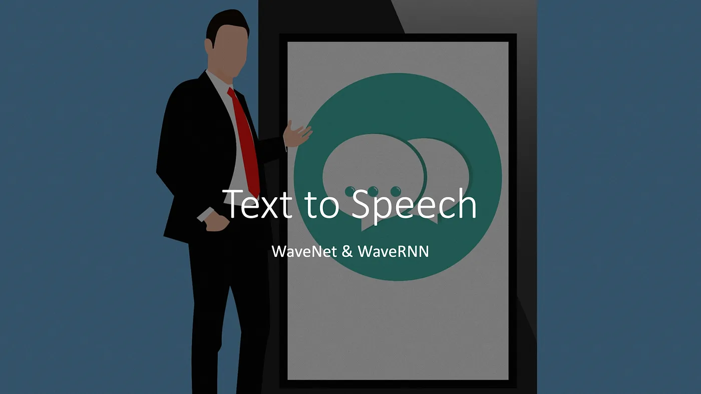
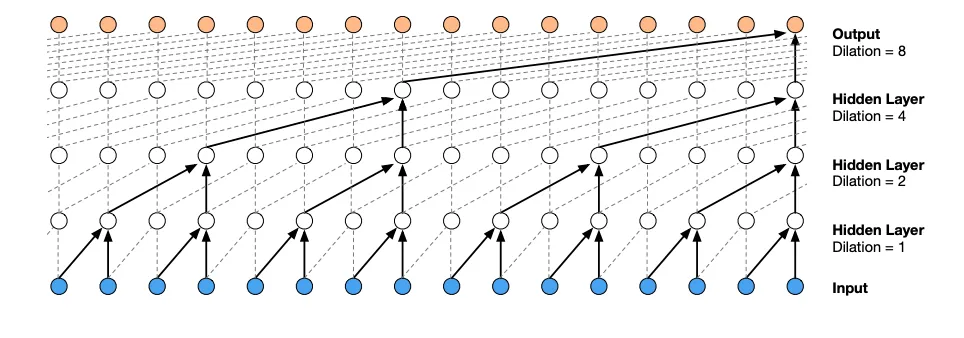
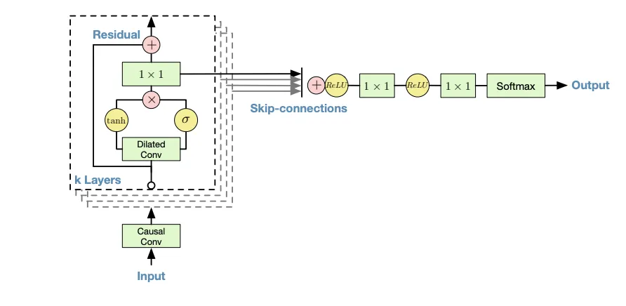
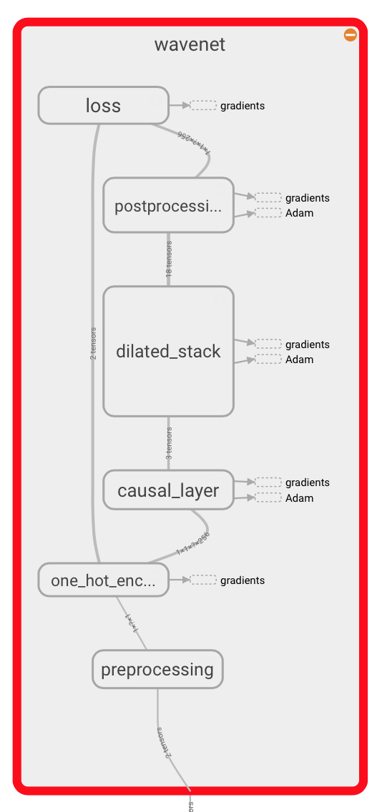

### OVERVIEW:
Text-to-audio generation is the process of converting text data into speech audio, and it plays a crucial role in various applications.

For example,

1.It enables robots to converse freely with humans.
2.Helps speech-disabled individuals to communicate with computers.
3.Converts educational documents into audio for better accessibility.
In addition to these applications, virtual assistants like Siri and Google and other virtual assistants require audio generation capability to interact with humans.

Research on text-to-speech has been ongoing since the 1960s, and recent breakthroughs in advanced neural network architecture and computing power have led to the development of various text-to-speech models that perform exceptionally well.

In this article, we will explore WaveNet, a speech-to-text model, and discuss its core building blocks.

### Introduction to WaveNet 
WaveNet is a deep neural network model that has gained significant attention in recent years due to its remarkable performance in generating high-quality audio waveforms. It was introduced in a 2016 paper by researchers at DeepMind, and has since been used in various applications such as speech synthesis, speech recognition, and music generation.

One of the key features that make WaveNet effective is its ability to generate audio waveforms at the sample level, which means it can produce audio signals with much greater fidelity than other methods that work at the frame level. This is achieved through the use of a type of neural network called a dilated convolutional network.

The core building blocks of WaveNet are its dilated causal convolutional layers, which allow the model to process temporal sequences of audio signals. These layers are called “dilated” because they have gaps between the input samples that increase exponentially with depth. This means that each layer can receive input from a larger receptive field, which enables the model to capture long-term dependencies in the audio signal.

Another important aspect of WaveNet’s architecture is its use of residual connections, which allow the model to bypass layers and reuse previously learned information. This helps to mitigate the vanishing gradient problem that is commonly encountered in deep neural networks, where gradients become too small to effectively update the parameters of the network.

Finally, WaveNet uses a probabilistic approach to audio generation, where it models the distribution of the audio signal at each time step. This allows the model to generate a wide range of audio signals, which makes it well-suited for applications such as speech synthesis and music generation.

### Implementation part
This is a TensorFlow implementation of the WaveNet generative neural network architecture for audio generation.
'https://deepmind.google/discover/blog/wavenet-a-generative-model-for-raw-audio/'.

* The WaveNet neural network architecture directly generates a raw audio waveform, showing excellent results in text-to-speech and general audio generation (see the DeepMind blog post and paper for details).

* The network models the conditional probability to generate the next sample in the audio waveform, given all previous samples and possibly additional parameters.

* After an audio preprocessing step, the input waveform is quantized to a fixed integer range. The integer amplitudes are then one-hot encoded to produce a tensor of shape (num_samples, num_channels).

* A convolutional layer that only accesses the current and previous inputs then reduces the channel dimension.

* The core of the network is constructed as a stack of causal dilated layers, each of which is a dilated convolution (convolution with holes), which only accesses the current and past audio samples.

The outputs of all layers are combined and extended back to the original number of channels by a series of dense postprocessing layers, followed by a softmax function to transform the outputs into a categorical distribution.

The loss function is the cross-entropy between the output for each timestep and the input at the next timestep.

## SAMPLE PROJECT IMPLEMENTATION  OF WAVENET IN TensorFlow
DATASET: 'https://urbansounddataset.weebly.com/download-urbansound8k.html'
DESCRIPTION This dataset contains 8732 labeled sound excerpts (<=4s) of urban sounds from 10 classes: air_conditioner, car_horn, children_playing, dog_bark, drilling, enginge_idling, gun_shot, jackhammer, siren, and street_music. The classes are drawn from the urban sound taxonomy. For a detailed description of the dataset and how it was compiled please refer to our paper.

Find the implementation in /CAEI/CAEI_AI_MODELS/WAVENET/audio_classification.ipynb 